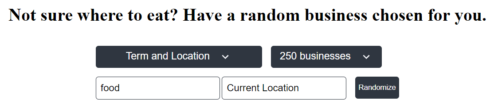
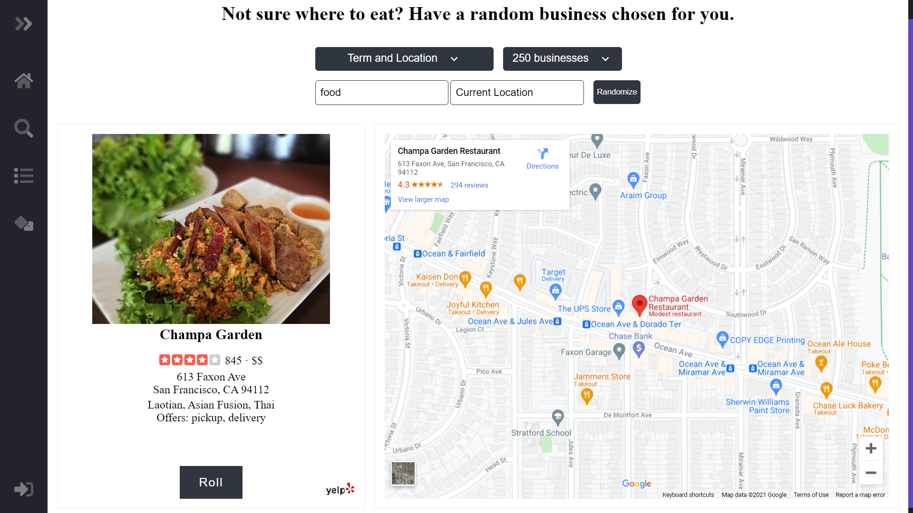
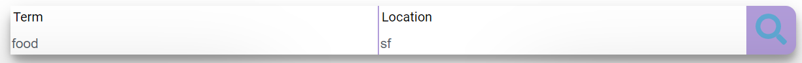
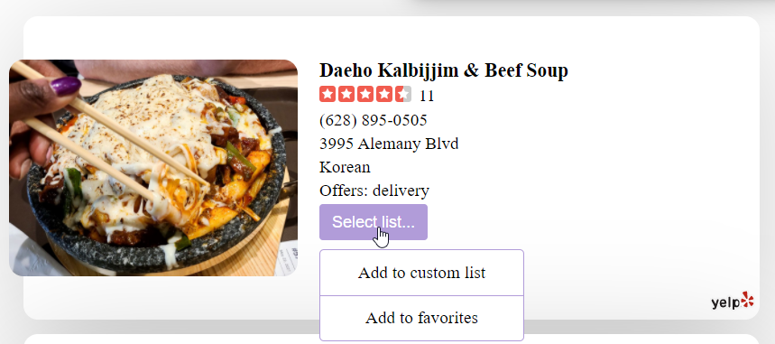
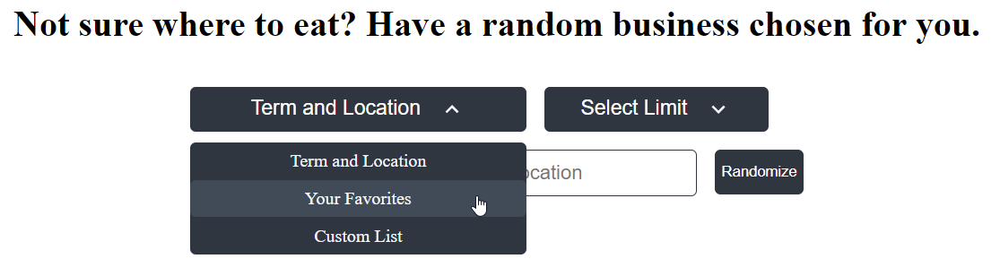

<h1 align="center">Foodist-v2 - Random Business Picker</h1>

**Foodist revamped with user authenication and randomization from user lists. Pick a dish and see which restaurants will serve that. If nothing you like is listed, you can also search! Not sure where to eat, have a place chosen for you!**

Live site: [https://foodist-v2.herokuapp.com/](https://foodist-v2.herokuapp.com/)

# Table of Contents
  - [:one: How To Use Application](#one-how-to-use-application)
    - [To Have a Random Business Chosen For You](#to-have-a-random-business-chosen-for-you)
    - [To Randomize From a List](#to-randomize-from-a-list)
  - [:two: :checkered_flag: Quick Start Development](#two-checkered_flag-quick-start)
    - [Installation/Running Locally for Development](#installationrunning-locally-for-development)
      - [1. Installing dependencies](#1-installing-dependencies)
      - [2. Start Server and Build React Application](#2-start-server-and-build-react-application)
  - [:three: Technologies Used](#three-technologies-used)

## :one: How To Use Application

### To Have a Random Business Chosen For You:
- Head to the random page. 
- Enter an optional term like the food or drink you want. Location is required. 
- Select a limit for how many businesses are returned with default being 50.
- Hit the randomize button.

- A business will be shown and you can press roll for the next random business.


### To Randomize From a List:
- Head to the search page.
- Search for businesses.

- Add restaurant to list. You do not need an account to add to a custom list. All businesses you add to the custom list will not be saved after you leave the application. If you want to save a list for future use then you need to register an account and add it your favorites.

- Once you have several options in your list, head over to the random page.
- Select list that you want to randomize from.

- Randomize from the current list and you can press roll if there list has more than 1 entry.

## :two: :checkered_flag: Quick Start Development

### Installation/Running Locally for Development

**You’ll need to have Node >= 6 on your machine**. You can use [nvm](https://github.com/creationix/nvm#installation) to easily switch Node versions between different projects.

#### 1. Installing dependencies
```sh
npm install
```

#### 2. Start Server and Build React Application
```sh
npm run build
# Open up a new terminal
npm start
```
or
```sh
npm run build & npm run start
```

Then open [http://localhost:3000/](http://localhost:3000/) to see your app.<br>

## :three: Technologies Used
* JavaScript
* HTML5/CSS3
* React
* Redux
* Express
* Node.js
* React Router DOM
* Styled-Components
* MongoDB
* Passport.js
